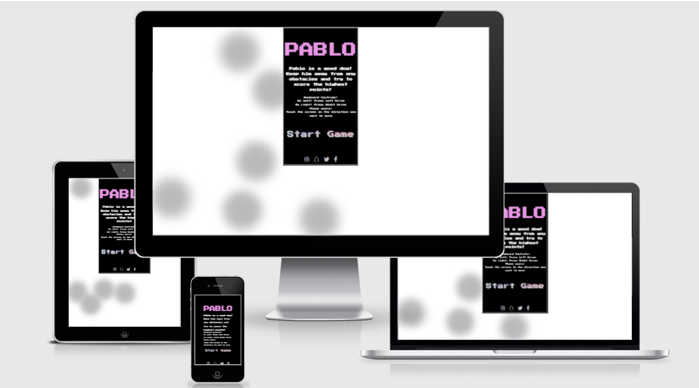

# PABLO: The Game
PABLO is a retro-style "runner" game where the objective is to get as far as possible while dodging incoming obstacles and obtaining the most points.
The game's main character is Pablo the dog. You'll be controlling Pablo and keeping him out of trouble by moving left or right and dodging obstacles. 

The homepage contains full gameplay instructions so its easy to start playing immediately.
Pablo is playable on both mobile and PC as it has full touch controls AND keyboard controls.

The game is meant to provide entertainment value for users who have a bit of downtime and want to unwind by playing a quick game. Pablo harks back to simpler times as as you can see from the pixelated graphics and the retro arcade text font. 

This app's target audience will be both children and adults of all ages as the game is simple and easy to understand but at the same time very entertaining.

# Features

**Header / Title**

- At the top of the home page the header shows the name of the website / game : PABLO .
- The name is very clear and easy to read as it has a good size and contrasted font color.

**Game Description**

- At the middle of the game area there is a "short but sweet" introduction to the game, this tells you the aim of the game in a way that doesn't break immersion but doesn't reveal too much.

- This section is also very clear and easy to read as it has a good size color is in contrast with the black background.

**Start Game & Controls**

- The controls are clearly laid out, in smaller font size this time to suit most screen sizes. They provide the user with simple instructions on how to actually play the game. This is the first time the user sees how to interact with the app and that it works on both PC and touchscreen devices.

- The "Start Game" button initializes the game. It is a much bigger font size and its clearly visible due to the colorful animation around the font. 

 - This animation serves to point the user into the direction of the button and makes it obvious he needs to press it in order to start playing the game. The button is also animated with an underline when hovering over it.

**Socials**

- At the bottom of the game area there is a socials section which contains icons with links to most popular social media websites.

- The links open in a new tab and the icons are also animated when hovering over them.

**The Game**

- The game features Pablo the dog, situated in the bottom of the game area by default. He has a fully animated walk while the game is running.

- Pablo is able to move left or right using the keyboard (left arrow key and right arrow key) or by clicking in the direction you want to move on a touchscreen device.

- The aim of the game is to dodge the incoming obstacles.

- These obstacles will come down randomly in one of three lanes; left, middle or right.

- The speed at which they come down is constant and linear in order to make the game fair.

- Pablo has a "Score" feature, located in the top left of the game area. This allows you to see your score in real time and at the end of each run. This promotes competition and replay-ability as the user will want to beat their previous high score.

- Pablo will gain 1 score point per obstacle he dodges and this is updated in real time.

- Once Pablo has hit an obstacle the game ends.

- When the game has ended all animation stops including Pablo's walking animation.

- In the "Game Over" screen the user is provided with visual feedback in the form of an animated "Game over! Try again?" text.

- The user is also able to choose from 2 buttons provided when prompted to "Try Again?". These buttons are : "Yes" which restarts the game and sets the score back to 0, "No" which takes the user back to the homepage.

# Features left to implement

When I have more time I would like to implement the following:

-   Bigger variety of obstacles (different cars, motorcycles, buildings) with different properties to them (some faster, some wider etc.)

- A "power-up" that would come down instead of an obstacle and give the user an incentive to go get it. If the user gets the power-up he would receive a large amount of score points or a special effect.

- A level system where each level gets harder as you go.

- A highscore table to track the top 5 biggest scores overall.

# Testing
- I've tested the website in the most popular web browsers and I can confirm it works: Chrome, Mozilla, Safari, Brave

- I've also confirmed the project is responsive on all screen sizes, I did this using the developer tools in Chrome.

- I've tested the collision mechanics and confirmed they work correctly 100% of the time.

- I've tested all the buttons and navigation and they all work as intended.

- I've confirmed the app is well contrasted and easy to understand.

- I've confirmed the game is functional and have sent it to 10 people to test in order to find bugs.

**Validator Testing**

- HTML - I tested the code through the official W3C validator and no errors were returned in both the index.html page and game.html as per screenshot below;

- CSS - I tested the code through the official Jigsaw validator and no errors were returned as per screenshot below;

- Accessibility - I tested the web page through the lighthouse tool in devtools and I can confirm the colors and fonts are all easy to read and accessible. I did this check for both index.html and game.html

- Javascript - I tested my javascript code through JShint and no major errors were returned as per screenshot below;

**Bugs**

- There were a few warnings in JShint however when investigating I believe they are to do with the version of javascript which we are using.

- When an obstacle is right next to Pablo in a different lane, the game will be over if you move Pablo into that lane and touch the obstacle. 
Some users might consider this a bug, however this is a feature but it happens quite fast and it can confuse the user as to why he lost.

# Deployment

The web site was deployed to GitHub pages with everything going smoothly the first attempt:

- In my GitHub repository, navigated to the settings tab

- On the left hand side menu look for the Pages section and click on it

- From the source drop-down menu, select Main Branch and click save

- After a few seconds the page provided a link to my hosted website

PABLO: the game link can be found here [PABLO](https://raoulrv.github.io/pablo-game/index.html)

# Credits

**Content**

- The main idea for this project was inspired from this [youtube video](https://www.youtube.com/watch?v=Sz7ugHHlvX4)

- The text animation was taken and modified by me from [this website](https://wweb.dev/resources/creative-hover-effects/)

- The background animation for my homepage was taken from the same website as above

**Media**

- The obstacle car image was taken from [Clipartmax](https://www.clipartmax.com/download/m2i8m2A0K9G6b1i8_medium-image-car-pixel-art-top-view/)

- The Pablo dog image was taken from [Pngkey](https://www.pngkey.com/detail/u2y3a9e6q8o0u2i1_my-sprite-sheet-of-a-dog-i-made/)

- The road background was taken from Google Images

